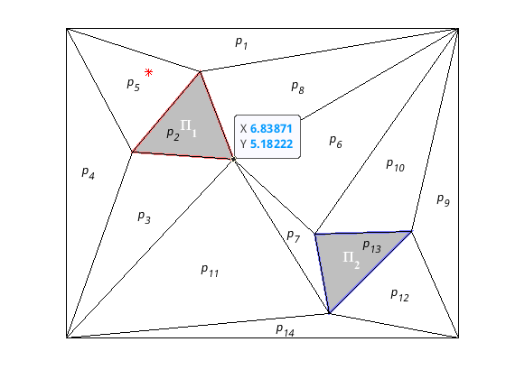

# Modelo de red de Petri del equipo de robots

Siguiendo las instrucciones del guión y del programa definimos un entorno sencillo con un robot y dos regiones de interés como la mostrada en la figura \ref{fig:entorno1}.

{ width=70% }

Como se puede observar, se han definido las regiones de interés $\Pi_1$ y $\Pi_2$ las cuales se han asignados a los lugares $p2$ y $p3$ respectivamente. Y se ha posicionado un robot en el lugar $p5$.

Se ha creado una función en Matlab (Listado \ref{lst:petriNetBuilder}) que toma como entrada la estructura del entorno y devuelve las matrices $PRE$ y $POST$, la matriz de incidencia $C$, el marcado inicial $m0$, la matriz de con los vectores característicos de cada observación, $V$ y la matriz de adyacencia $adj$. El código esta comentado explicando cada uno de los procedimientos.

```{label="lst:petriNetBuilder" caption="Función petriNetBuilder"}
function [ PRE, POST, C, m0, V, adj] = petriNetBuilder( T )
%PETRINETBUILDER From an environment definition build the petri net model

% From adjacency matrix, remove diag.
adj = T.adj - sparse(T.Q,T.Q,ones(1,numel(T.Q)));

% We thus obtain the total number of transitions from one place to another,
% in both directions.
[ii,jj,~] = find(adj);

% We construct the PRE and POST matrices and use the non-zero indices from 
% the previous matrix. The transitions are numbered sequentially in the 
% columns, and the rows correspond to the places.
PRE =  sparse(ii,1:length(ii),ones(1,length(ii)));
POST =  sparse(jj,1:length(jj),ones(1,length(jj)));

% We create the incidence matrix.
C = POST - PRE;

% We construct the initial marking through the vector T.R0 which contains
% the position of each robot. We create a sparse matrix, taking advantage 
% of the fact that the sparse function accumulates the value if the indices
% are repeated.
m0 = sparse(1,T.R0(:), 1, 1,numel(T.Q));

% We create the matrix with the characteristic vectors of each observation.
% This means that for each region of interest (row), the places
% (columns) that contain them are marked.
V = spalloc(numel(T.props), numel(T.obs), numel(cell2mat(T.props)));
for i=1:length(T.props)
    V(i,T.props{i}) = 1;
end

end
```
