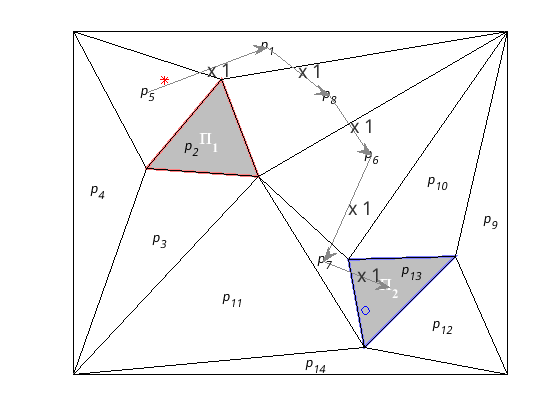

# Cálculo del marcado final y trayectorias

Con toda la información generada en apartados anteriores podemos iniciar la resolución de un problema de optimización de la forma:

$$
\begin{aligned}
&min f \cdot x \\
&A_{ineq} \cdot x \leq B_{ineq} \\
&A_{eq} \cdot x = B_{eq}
\end{aligned}
$$

Queremos calcular un estado final ($m$), una trayectoria que corresponde con los disparos de las transiciones ($\sigma$) y el cumplimiento de la misión ($Var$).

Por tanto:

$$
x = \begin{bmatrix} m \\ \sigma \\ Var \end{bmatrix}
$$

Como lo que queremos es minimizar la trayectoria

$$
\begin{aligned}
1^{T} \sigma &= f \cdot x \\
1^{T} \sigma &= f \cdot  \begin{bmatrix} m \\ \sigma \\ x \end{bmatrix} \\
\end{aligned}
$$

$$
f = \begin{bmatrix} 0 & 1 & 0 \end{bmatrix}
$$

Ahora obtendremos los valores de $A_{eq}$ y $b_{eq}$ partiendo de la ecuación de la red de Petri:

$$
\begin{aligned}
m &= m_0 + C \cdot \sigma \\
m - C\sigma &= m_0
\end{aligned}
$$

$$
A_{eq} \cdot \begin{bmatrix} m \\ \sigma \\ x \end{bmatrix} = b_{eq}
$$
$$
A_{eq} = \begin{bmatrix} I & -C & 0 \end{bmatrix}
$$
$$
b_{eq} = m_0
$$

A continuación obtendremos los valores de $A_{ineq}$ y $b_{ineq}$ para lo cuál haremos uso de las desigualdades obtenidas anteriormente:

$$
\Delta \cdot Var \leq b
$$
$$
N \cdot Var \geq V \cdot m \rightarrow V \cdot m - N \cdot Var  \leq 0
$$
$$
Var \leq V \cdot m \rightarrow Var - V \cdot m \leq 0
$$
$$
A_{ineq} \cdot x \leq b_{ineq} 
$$
$$
\begin{bmatrix} 
    0 & 0 & A \\
    V & 0 & -N \\
    -V & 0 & I
\end{bmatrix} \cdot
\begin{bmatrix} m \\ \sigma \\ x \end{bmatrix}
\leq
\begin{bmatrix} b \\ 0 \\ 0 \end{bmatrix}
$$

Por último utilizaremos la función `cplexmilp` que resuelve problemas de programación lineal entera mixta. Solo queda definir una seria de parámetros adicionales como es el límite inferior, en nuestro caso 0. Esto es porque el limite inferior en todos los lugares es 0. Además debemos indicar el tipo de variables del sistema, en nuestro caso $m$ y $\sigma$ son enteros(`I`) y $Var$ es booleano(`B`). Se ha programado una función en Matlab `findPaths` que toma como parámetros la matriz de incidencia $C$, la matriz con las observaciones $V$, el marcado inicial $m_0$, la fórmula booleana y el número de variables que la componen. Esta función devuelve el marcado final ($m_f$), las transiciones disparadas ($\sigma$) y las variables de la misión $Var$, así como información devuelta por el solucionador.

```
function [mf, sigma, compliance, fval,exitflag,output] = findPaths(C, V, m0, formula, nr_props)
%FINDPATHS From petriNetBuilder return values and a boolean formula returns
% minimal step to accomplish the mission

% We obtain the constraints in matrix form.
[A,b] = formula2constraints(formula, nr_props);

% We calculate sizes for later use.
[nr_restrictions, ~] = size(A);
[m_size,sigma_size] = size(C); 
[nr_obs, ~ ] = size(V);

% We calculate the size of the target variable vector.
x_m = m_size + sigma_size + nr_props;

fprintf("Number of variables (%d): m(%d) + \\sigma(%d) + props(%d)\n", x_m , m_size, sigma_size, nr_props);

% Vector f
% x = [    m                 \sigma             Var         ]
f = [ zeros(1,m_size) ones(1,sigma_size) zeros(1, nr_props) ];

% Calculation of N strictly greater than the number of robots.
N = sum(m0) + 1;

% Aineq = [ 0  0  A
%           V  0  -N
%          -V  0  I  ]
Aineq = [
    zeros(nr_restrictions, m_size), zeros(nr_restrictions,sigma_size),  A;
    V,                              zeros(nr_obs, sigma_size),          -N*eye(nr_obs,nr_props);
    -V,                             zeros(nr_obs, sigma_size),          eye(nr_obs,nr_props);
];

% bineq = [ b 0 0 ]
bineq = [b; zeros(nr_obs,1); zeros(nr_obs,1)];

% Aeq = [ I  -C  0 ]
Aeq = [eye(m_size,m_size), -C, zeros(m_size, nr_props)];
beq = m0';

% Cplex Solver 
sostype=[];
sosind=[] ;
soswt=[];
ub=[];
% Set the lower limit.
lb = zeros(size(f));
% Create type vector
ctype = char([ones(1,m_size)*'I' ones(1,sigma_size)*'I' ones(1, nr_props)*'B']);

[x,fval,exitflag,output] = cplexmilp(f,Aineq,bineq,Aeq,beq,sostype,sosind,soswt,lb,ub,ctype);

% Final state
mf = x(1:m_size);
offset = m_size;
% Triggers
sigma = x(offset+1:offset+sigma_size);
offset = offset + sigma_size;

% Compliance
compliance = x(offset+1:offset+nr_props);

end
```

Utilizando los valores devueltos podemos obtener la información de la trayectoria y el marcado final. En la imagen \ref{fig:solucion1}, observamos la trayectoria del robot mediante flechas grises y un multiplicador que indica el número de veces que se se realica ese desplazamiento. Los asteríscos rojos representan el estado incial y los circulos azules el estado final.

{ width=70% }


