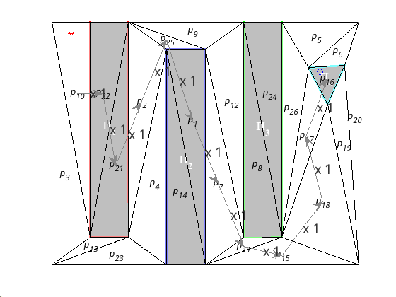

# Otros escenarios

En el escenario  de la figura \ref{fig:solucion2} se definen cuatro robots, tres regiones de interés y la fórmula boolean $A\&B\&!C$. Observamos que de la región de interés $\Pi3_3$ la flecha lleva asociado un multiplicador $x4$ que indica que todos los robots salen de esa región. El marcado final de la imagen sitúa: un robot en $\Pi_1$, un robot en $\Pi_2$, dos robots en el lugar $p_9$ y ninguno en la región $\Pi_3$. Por lo tanto vemos que se cumple la misión. Es importante destacar, que la misión se cumple a nivel de equipo.

{ width=70% }

En la imagen de la figura \ref{fig:solucion3} se ha definido un entorno más complejo con un robot y una especie de laberinto con tres regiones verticales ($\Pi_1$,$\Pi_2$ y $\Pi_3$) y la región $\Pi_4$. Se ha definido la fórmula booleana $!A\&!B\&!C\&D$, esperando conseguir una ruta serpenteante. Como se observa en la imagen, el algoritmo necesitaria mayor información para tratar las regiones $\Pi_1$,$\Pi_2$ y $\Pi_3$ como obstáculos a evitar, ya que en su resolución atraviesa estas regiones.

{ width=70% }

Y por último el entorno de la figura \ref{fig:solucion4}, donde se han posicionado: cuatro robots y cinco regiones de interés; y se ha planteado la misión $A\&B\&C\&!D\&!E$. La idea inicial era plantear un cuello botella con las regiones $\Pi_4$ y $\Pi_5$. Debido a la limitación anterior se observa que los robots atraviesan dichas regiones.

{ width=70% }
